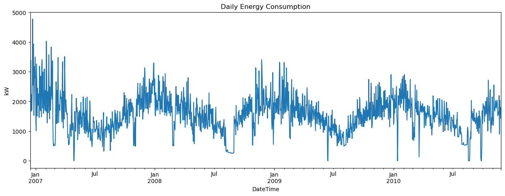
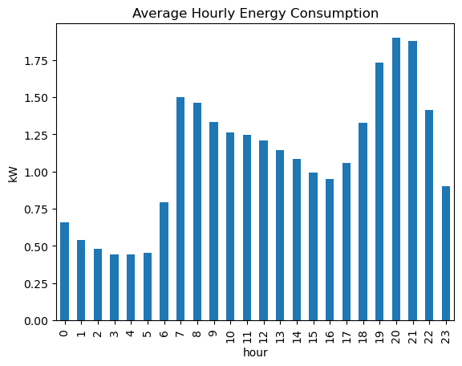
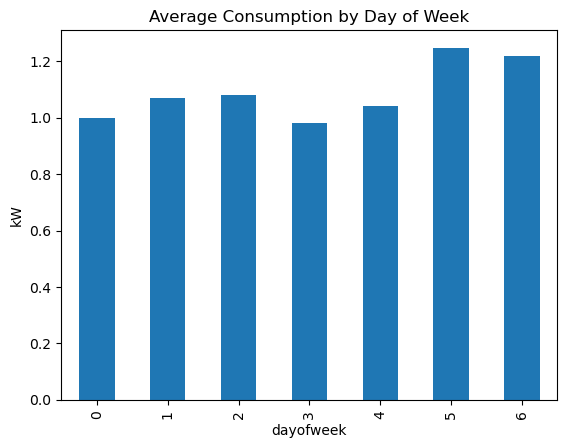

# Energy Consumption Analysis

## Problem Statement

Efficient energy management is crucial for reducing both household expenses and environmental impact. This project investigates detailed household energy consumption data to identify usage patterns, detect inefficiencies, and offer actionable recommendations for optimizing energy use.

---

## Dataset Source and Link

- **Dataset:** Household Electric Power Consumption
- **Source:** Kaggle  
- **Link:** [https://www.kaggle.com/datasets/uciml/electric-power-consumption-data-set](https://www.kaggle.com/datasets/uciml/electric-power-consumption-data-set)

---

## Methodology

1. **Data Collection:** Downloaded from Kaggle.
2. **Data Cleaning & Preprocessing:**
   - Removed missing/erroneous values.
   - Combined and converted date and time columns to a DateTime index.
   - Converted relevant fields to numeric types.
3. **Exploratory Data Analysis (EDA):**
   - Calculated total, average, max, and min energy consumption.
   - Analyzed daily, weekly, and monthly consumption trends.
   - Visualized daily and hourly usage patterns.
   - Identified peak consumption hours and days of week.
   - Checked correlation between voltage and power consumption.
   - Detected outlier periods of unusually high consumption.
4. **Feature Engineering:**
   - Added features for hour, day of week, and weekend/weekday.
5. **Saving Cleaned Data:** Exported the cleaned dataset for further use.

---

## Key Findings/Insights

- **Peak Usage Hours:** Highest consumption typically occurs during evening hours (6 PM – 9 PM).
- **Weekly Trends:** Weekdays, especially mid-week, generally see higher usage than weekends.
- **Outliers:** Occasional spikes suggest possible appliance inefficiency or unique household activities.
- **Voltage Correlation:** Weak or negligible correlation between voltage and power consumption.
- **Weekend Effect:** Consumption drops slightly on weekends.






---

## Recommendations

1. **Shift Appliance Use:** Use high-power appliances during off-peak hours.
2. **Audit for Anomalies:** Investigate days with unusually high usage for appliance inefficiency.
3. **Target Evening Hours:** Focus energy-saving practices on peak hours.
4. **Ongoing Monitoring:** Regularly track and visualize usage for continuous improvement.

---

## How to Run the Code

### Setup & Requirements

1. **Clone this repository:**
   ```bash
   git clone https://github.com/yourusername/energy-consumption-analysis.git
   cd energy-consumption-analysis
   ```
2. **Install requirements:**
   ```bash
   pip install -r requirements.txt
   ```
3. **Download the dataset** from [Kaggle](https://www.kaggle.com/datasets/uciml/electric-power-consumption-data-set) and place it in the root or `data/` folder.

4. **Run the analysis script:**
   ```bash
   python analysis.py
   ```

---

## License

This project is licensed under the MIT License. See [LICENSE](LICENSE) for more details.

---

**Project by [charankumar3009]**
